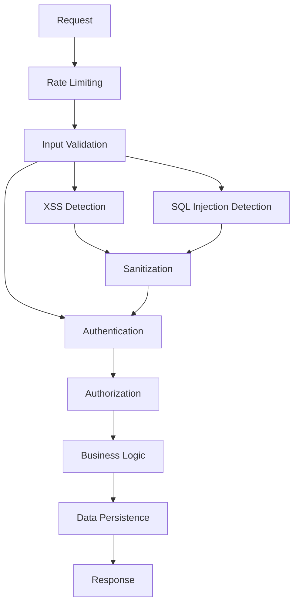

# 🏗️ Architecture Guide - Surebets System

> Para status, roadmap, conquistas e próximos passos, consulte o checklist consolidado em [CHECKLIST_PRODUCAO.md](CHECKLIST_PRODUCAO.md).

## Visão Geral

O sistema Surebets foi projetado com arquitetura modular enterprise-ready, separação de responsabilidades, segurança avançada e foco em escalabilidade, testabilidade e facilidade de manutenção. A arquitetura implementa múltiplas camadas de segurança, validação rigorosa e sistema de autenticação JWT robusto.

---

## 📦 Estrutura de Pastas Atualizada

```
Surebets-System/
├── backend/
│   ├── apps/         # Aplicações principais (dashboard, admin_api, adapters)
│   ├── core/         # Utilitários centrais (auth, i18n, validation)
│   │   ├── auth.py       # Sistema JWT avançado com blacklist
│   │   ├── validation.py # Validação Pydantic e sanitização
│   │   └── i18n.py       # Internacionalização
│   ├── services/     # Serviços de negócio (arbitrage, notification)
│   ├── database/     # Banco de dados e scripts
│   └── tests/        # Testes estruturados
│       ├── unit/         # Testes unitários
│       ├── integration/  # Testes de integração JWT
│       ├── security/     # Testes de segurança e penetração
│       └── performance/  # Testes de performance
├── frontend/         # Interface desktop (Tkinter)
├── config/           # Configurações e variáveis de ambiente
├── docker/           # Dockerfiles e docker-compose
├── src/              # Entry point e dependências
└── docs/             # Documentação expandida
    ├── JWT_FRONTEND_INTEGRACAO.md  # Novo: Guia de integração
    └── SECURITY.md                 # Documentação de segurança
```

---

## 🔗 Padrões Arquiteturais Implementados

### Core Patterns
- **Separation of Concerns**: Cada módulo tem responsabilidade única
- **Dependency Injection**: Facilita testes e manutenção
- **Factory Pattern**: Criação dinâmica de adaptadores
- **Observer Pattern**: Notificações e eventos
- **Strategy Pattern**: Algoritmos de arbitragem intercambiáveis

### Security Patterns
- **Defense in Depth**: Múltiplas camadas de proteção
- **Input Validation**: Validação em todas as camadas
- **Authentication & Authorization**: JWT com roles granulares
- **Secure by Default**: Configurações seguras por padrão

### Validation Architecture
- **Schema-Based Validation**: Pydantic para entrada
- **Sanitization Pipeline**: Limpeza automática de dados
- **Attack Detection**: Detecção de SQL Injection e XSS
- **Rate Limiting**: Proteção contra abuso

---

## 🔄 Fluxo de Dados com Segurança



### Detalhamento do Fluxo

1. **Rate Limiting**: Proteção contra DDoS e abuse
2. **Input Validation**: Schemas Pydantic validam estrutura
3. **Security Scanning**: Detecção de XSS e SQL Injection
4. **Sanitization**: Limpeza automática de dados perigosos
5. **Authentication**: Verificação JWT com blacklist
6. **Authorization**: Verificação de roles e permissões
7. **Business Logic**: Processamento seguro dos dados
8. **Audit Logging**: Registro de eventos de segurança

---

## 🔒 Arquitetura de Segurança

### Camadas de Proteção

#### 1. Perímetro (Network Layer)
- Rate limiting por IP
- Headers de segurança obrigatórios
- CORS configurado adequadamente

#### 2. Aplicação (Application Layer)
- Validação Pydantic rigorosa
- Sanitização automática de inputs
- Detecção de padrões de ataque

#### 3. Autenticação (Auth Layer)
```python
# Arquitetura JWT
AuthManager
├── TokenBlacklist (Redis/Memory)
├── Role-Based Access Control
├── Permission Granular System
└── Refresh Token Management
```

#### 4. Dados (Data Layer)
- Prepared statements para SQL
- Sanitização antes de persistência
- Audit trail de modificações

### Sistema de Roles e Permissões

```python
ROLE_PERMISSIONS = {
    ROLE_ADMIN: {
        'can_manage_users': True,
        'can_delete_data': True,
        'can_configure_system': True,
        'can_manage_odds': True,
        'can_place_bets': True,
        'can_view_reports': True,
        'can_view_dashboard': True
    },
    ROLE_OPERATOR: {
        'can_manage_users': False,
        'can_delete_data': False,
        'can_configure_system': False,
        'can_manage_odds': True,
        'can_place_bets': True,
        'can_view_reports': True,
        'can_view_dashboard': True
    },
    ROLE_VIEWER: {
        'can_manage_users': False,
        'can_delete_data': False,
        'can_configure_system': False,
        'can_manage_odds': False,
        'can_place_bets': False,
        'can_view_reports': True,
        'can_view_dashboard': True
    }
}
```

---

## 🧪 Arquitetura de Testes

### Estrutura de Testes

```
backend/tests/
├── unit/                    # Testes isolados
│   ├── test_auth.py            # Auth e JWT
│   └── test_validation.py      # Validação Pydantic
├── integration/             # Testes de fluxo
│   ├── test_jwt_auth.py        # Fluxo completo JWT
│   └── test_arbitrage_system.py
├── security/                # Testes de segurança
│   ├── test_security_validation.py  # Proteções básicas
│   └── test_penetration.py         # Testes avançados
└── performance/             # Testes de carga
    └── test_performance.py
```

### Estratégias de Teste

- **Unit Tests**: Isolamento de componentes
- **Integration Tests**: Fluxos completos de autenticação
- **Security Tests**: Fuzzing e tentativas de ataque
- **Performance Tests**: Carga e concorrência
- **Penetration Tests**: Simulação de ataques reais

---

## 📈 Escalabilidade e Performance

### Otimizações Implementadas

#### Cache Layer
- Redis para blacklist de tokens
- Cache de permissões de usuário
- Cache de configurações frequentes

#### Database Optimizations
- Índices em campos de busca frequente
- Prepared statements para performance
- Connection pooling

#### Application Layer
- Lazy loading de módulos
- Paginação em listas grandes
- Compressão de responses

### Monitoramento

```python
# Métricas coletadas
- Request rate per endpoint
- Authentication success/failure rate
- Token blacklist size
- Validation errors by type
- Response times by endpoint
```

---

## 🌍 Internacionalização Avançada

### Sistema i18n Atualizado

```python
# Estrutura de tradução
core/i18n.py
├── get_text(key, language)     # Tradução dinâmica
├── validation_messages         # Mensagens de erro
├── security_alerts            # Alertas de segurança
└── user_notifications         # Notificações ao usuário
```

### Suporte a Idiomas
- **PT-BR**: Português brasileiro (padrão)
- **EN**: Inglês internacional
- **Extensível**: Arquitetura preparada para novos idiomas

---

## 🔧 Configuração e Environment

### Variáveis de Ambiente de Segurança

```bash
# JWT Configuration
JWT_SECRET_KEY=your-secret-key
JWT_ACCESS_TOKEN_EXPIRES_MINUTES=60
JWT_REFRESH_TOKEN_EXPIRES_DAYS=30

# Security Settings
ENVIRONMENT=production
RATE_LIMIT_PER_MINUTE=100
ENABLE_CORS=false

# Redis (Token Blacklist)
REDIS_URL=redis://localhost:6379/0

# Admin Account
ADMIN_USERNAME=admin
ADMIN_PASSWORD_HASH=your-hashed-password
```

### Configurações de Desenvolvimento vs Produção

```python
# Development
- SQLite em memória para testes
- Logs detalhados
- CORS permissivo
- Blacklist em memória

# Production  
- PostgreSQL com SSL
- Logs estruturados
- CORS restritivo
- Redis para blacklist
- Rate limiting agressivo
```

---

## 🚀 Deployment Architecture

### Containerization

```dockerfile
# Multi-stage build
FROM python:3.9-slim as base
FROM base as dependencies
FROM base as production

# Security hardening
RUN useradd --create-home --shell /bin/bash app
USER app
```

### Orquestração

```yaml
# docker-compose.yml
services:
  backend:
    - Aplicação principal
    - Health checks
    - Restart policies
  redis:
    - Token blacklist
    - Cache layer
  nginx:
    - Reverse proxy
    - Rate limiting
    - SSL termination
```

---

## 🔍 Observabilidade

### Logging Structure

```python
# Logs estruturados
{
  "timestamp": "2023-06-01T12:00:00Z",
  "level": "WARNING",
  "component": "auth",
  "event": "login_failed",
  "user": "admin",
  "ip": "192.168.1.1",
  "details": {...}
}
```

### Métricas

- **Authentication**: Success/failure rates
- **Authorization**: Permission denials
- **Security**: Attack attempts blocked
- **Performance**: Response times, throughput
- **Errors**: Error rates by type

### Health Checks

```python
# Verificações de saúde
/health
├── database_connection
├── redis_connection  
├── token_blacklist_status
├── memory_usage
└── disk_space
```

---

## 🔒 Security Checklist

### Implemented Protections

- [x] **Input Validation**: Pydantic schemas em todos os endpoints
- [x] **XSS Protection**: Sanitização automática com bleach
- [x] **SQL Injection**: Detecção de padrões suspeitos
- [x] **CSRF Protection**: Tokens CSRF obrigatórios
- [x] **JWT Security**: Blacklist, refresh tokens, expiração
- [x] **Rate Limiting**: Proteção contra abuse
- [x] **Security Headers**: Headers de segurança obrigatórios
- [x] **Role-Based Access**: Controle granular de permissões
- [x] **Audit Logging**: Registro de eventos de segurança
- [x] **Password Security**: Validação de força, hashing seguro

### Future Enhancements

- [ ] **WAF Integration**: Web Application Firewall
- [ ] **2FA Support**: Autenticação de dois fatores
- [ ] **API Keys**: Autenticação alternativa para APIs
- [ ] **Session Management**: Controle de sessões ativas
- [ ] **Threat Intelligence**: Integração com feeds de ameaças

---

## 🔗 Integração com Frontend

### Suporte a SPA (Single Page Applications)

- **JWT Headers**: Autenticação via Authorization header
- **Secure Cookies**: Suporte a cookies HttpOnly
- **CORS**: Configuração flexível para domínios
- **Refresh Tokens**: Renovação automática transparente

### Mobile Apps

- **JWT Native**: Tokens armazenados de forma segura
- **Deep Links**: Autenticação via deep links
- **Offline Support**: Cache local de permissões

---

## 📚 Referências Técnicas

### Design Patterns
- **OWASP Top 10**: Proteções implementadas
- **OAuth 2.0**: Padrão de autenticação seguido
- **RESTful APIs**: Princípios REST aplicados
- **Clean Architecture**: Separação de camadas

### Frameworks e Bibliotecas
- **Flask-JWT-Extended**: JWT robusto
- **Pydantic**: Validação de schemas
- **Bleach**: Sanitização XSS
- **Pytest**: Framework de testes
- **Redis**: Cache e blacklist

---

## 🔗 Links Relacionados

- **[Documentação de API](API.md)**
- **[Guia de Integração JWT](JWT_FRONTEND_INTEGRACAO.md)**
- **[Documentação de Segurança](SECURITY.md)**
- **[Guia de Desenvolvimento](DESENVOLVIMENTO_COMPLETO.md)**
- **[Roadmap de Produção](PRODUCTION_ROADMAP.md)**
